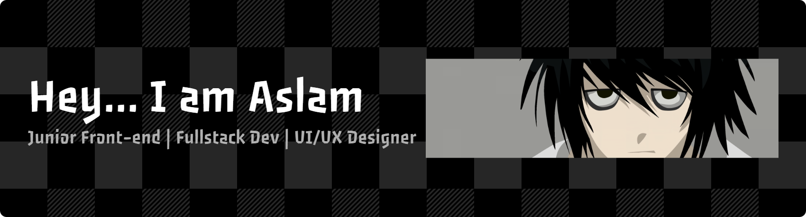

# Hi! I'm Muhammad Aslam Siddiq

  
#### a Computer Science - Software engineering student at [Bina Nusantara University](https://binus.ac.id/program/computer-science-software-engineering/) with a strong passion for technology, problem-solving, and building meaningful digital experiences.

#### I'm currently exploring opportunities for internships, especially in roles such as:
- Junior Front-End Developer
- Fullstack Developer
- UI/UX Designer
- Web Developer
- Application Developer
#### I'm also open to broader tech roles, including:
- Junior Software Engineer
- Data Analyst / Data Engineer
- AI Engineer
- Cyber Security
- and other related positions.

#### I’m always excited to learn new tools, collaborate with others, and contribute to impactful projects. Feel free to explore my repositories or connect with me!

# Tech Stack (in general):
                            

# Get In Touch
#### Feel free to contact me if you have any questions or just want to say hi.
##### [] Raxeronorouzi@gmail.com or muhammad.siddiq001@binus.ac.id
